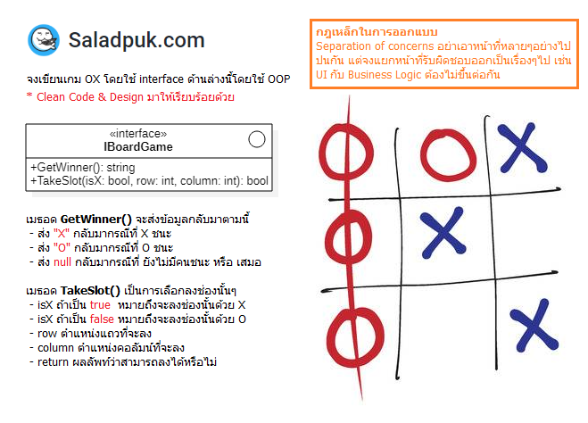

# Coding Dojo
> แมวน้ำเชื่อว่ามีหลายคนก็น่าจะสงสัยเรื่องนี้อยู่ไม่น้อย ว่าจะรู้ได้ไงว่าฝีมือแบบนี้ถึงเรียกว่า "กาก, พอใช้, ดี, เทพ" ซึ่งแมวน้ำเคยเจอบางคนทุ่มเวลาไปกับการศึกษา Algorithms แปลกๆใหม่ๆ บางคนทุ่มไปกับการอ่านหนังสือพวก OOAD (Object-Oriented Analysis & Design) และอื่นๆอีกมากมาย เพื่อที่จะขัดเกลาโค้ดตัวเองให้ดีขึ้น

หากใครอยากรู้ว่าตัวเองมีดีแค่ไหน? เขียนโค้ดได้ถึงระดับไหนแล้ว? ลองแก้โจทย์ด้านล่างนี้ดูนะ โดยต้องเขียนมาเป็น OOP และทำ Clean Code & Clean Design มาให้เรียบร้อย

## เกมส์ OX

## วิธีส่งตรวจ
* Fork จาก repo นี้ไปทำของใครของมัน แล้วทำ Pull-Request กลับมา แล้วแมวน้ำจะ comment ตรวจให้
